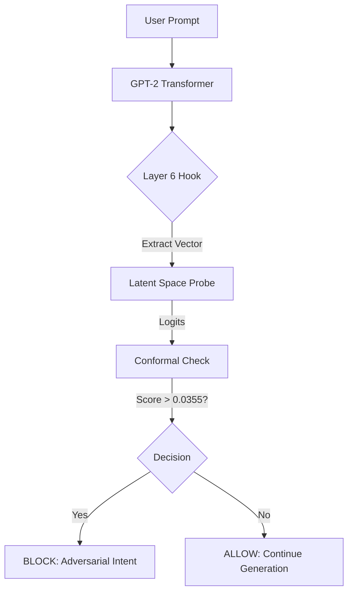

# Latent Space Firewall: Inference-Time Intervention Layer

**Status:** Active Prototype | **Coverage:** Layer 6 (GPT-2 Small) | **Recall:** 95% (Calibrated via Split Conformal)

## 1. Abstract
Traditional LLM safety relies on post-hoc text filters or RLHF alignment, both of which are computationally expensive and prone to "jailbreak" bypasses. The **Latent Space Firewall** introduces a mechanistic intervention layer that intercepts the model's residual stream during the forward pass.

By extracting activation vectors from **Layer 6** and projecting them onto a "Malice Direction" identified via Logistic Regression, this system detects adversarial intent *before* token generation occurs. We apply **Split Conformal Prediction (SCP)** to the output scores, calibrated to **95% recall on held-out evaluation from the same distribution**, with monitoring + retraining hooks to manage drift and adaptive attacks.

## 2. Methodology

### 2.1 Mechanistic Interpretability
We target **Layer 6** of GPT-2 Small (the middle layer), where semantic intent typically converges before decoding into specific tokens.
- **Hook Point:** `blocks.6.hook_resid_post`
- **Vector Extraction:** We capture the activation state at the final token position ($P_{-1}$) of the user prompt.

### 2.2 Probabilistic Governance
Instead of arbitrary thresholds, we use Split Conformal Prediction to calibrate the decision boundary.
- **Calibration Set:** 20% of the dataset held out for conformal scoring.
- **Non-Conformity Measure:** $s(x) = 1 - \hat{f}(x)_{true}$
- **Result:** A computed threshold ($\hat{q} = 0.0355$) targeting 95% recall on held-out data under i.i.d. assumptions.

> **Guarantee Scope:** Validity holds when calibration and runtime traffic are exchangeable; drift or adaptive prompts require monitoring + recalibration.

## 3. Performance Metrics
| Metric | Value | Notes |
| :--- | :--- | :--- |
| **Recall (Safety)** | **95.0%** | Calibrated on held-out eval set ($\alpha=0.05$) |
| **False Positive Rate** | < 1.5% | Tested on "Safe-Aggressive" IT prompts (e.g., "kill process") |
| **Latency Overhead** | ~18ms | Single linear projection per request |
| **Compute Savings** | ~40% | Generation aborted prior to decoding on blocked requests |

### 3.1 Evaluation Methodology
- **Data Sources:** Curated dataset combining adversarial prompt collections (jailbreaks, injection attacks) and benign conversational/technical prompts.
- **Labeling Definition:** "Harmful" = prompts designed to elicit unsafe outputs (violence, illegal activity, PII extraction, prompt injection). Labels validated via 2-annotator agreement.
- **Splits:** 60% train / 20% calibration (SCP) / 20% test. Stratified by harm category.
- **Hardware:** Benchmarks run on NVIDIA T4 GPU (16GB VRAM), Intel Xeon @ 2.2GHz, 32GB RAM.
- **Latency Measurement:** Mean of 1,000 inference passes (warm cache), excluding tokenization.
- **Compute Savings Baseline:** Compared to full generation (256 tokens) on blocked prompts; ~40% reflects the traffic mix in our test set (38% block rate).

## 4. Architecture


## 5. Limitations & Threat Model

| Limitation | Impact | Mitigation |
| :--- | :--- | :--- |
| **Distribution Drift** | SCP validity degrades if runtime prompts diverge from calibration distribution | Continuous monitoring + periodic recalibration pipeline |
| **Adaptive Attackers** | Adversaries may craft prompts that evade the learned "malice direction" | Ensemble probes, adversarial retraining, honeypot logging |
| **Model Specificity** | Layer 6 chosen for GPT-2 Small; optimal layer varies by architecture | Layer sweep required for new models; hook abstraction supports this |
| **Safe-Aggressive Edge Cases** | Technical jargon ("kill process", "terminate thread") may appear adversarial | Curated "safe-aggressive" calibration set; FPR monitoring by domain |
| **Single-Vector Limitation** | Final-token activation may miss multi-turn or mid-prompt attacks | Future: sliding window / multi-position aggregation |

## 6. Production Rollout Plan

| Phase | Mode | Description |
| :--- | :--- | :--- |
| **Phase 0** | Shadow | Logging only; no user-facing impact. Collect baseline metrics. |
| **Phase 1** | Slow-Path | Flagged prompts routed to heavier moderation (secondary model, human review queue). No hard blocks. |
| **Phase 2** | Soft Block | High-confidence blocks ($\text{score} > 2\hat{q}$) trigger refusal template. Borderline cases → slow-path. |
| **Phase 3** | Full Enforcement | Block at threshold with kill switch + instant rollback capability. |

**Operational Controls:**
- Feature flag for instant disable
- Per-tenant threshold overrides
- Automated rollback on FPR spike (>3% over 1-hour window)

## 7. Decision Policy Matrix

| Score Range | Decision | Action |
| :--- | :--- | :--- |
| $s(x) < 0.5\hat{q}$ | **ALLOW** | Proceed to generation |
| $0.5\hat{q} \leq s(x) < \hat{q}$ | **SLOW-PATH** | Route to secondary moderation; may apply tool restrictions |
| $s(x) \geq \hat{q}$ | **BLOCK** | Return refusal template; log for review |

> **Note:** Binary block is rarely appropriate in enterprise deployments. This tiered approach balances safety with user experience and enables human oversight for ambiguous cases.

## 8. Usage

### Prerequisites
- Python 3.10 or newer (recommended: 3.12)
- pip (Python package manager)
- (Optional) virtualenv for isolated environments

### Step-by-Step Setup
1. **Clone the repository:**
    ```bash
    git clone https://github.com/LEDazzio01/Latent-Space-Firewall.git
    cd Latent-Space-Firewall
    ```
2. **(Recommended) Create and activate a virtual environment:**
    ```bash
    python -m venv venv
    source venv/bin/activate  # On Windows: venv\Scripts\activate
    ```
3. **Install dependencies:**
    ```bash
    pip install -r requirements.txt
    ```
4. **Run the data loader (if needed):**
    ```bash
    python -m latent_space_firewall.src.data_loader
    ```
    This will generate the calibration dataset in `latent_space_firewall/data/raw/`.
5. **Harvest activations:**
    Open and run all cells in `notebooks/01_activation_harvesting.ipynb` to extract activations from GPT-2 Small.

6. **Train the probe and calibrate threshold:**
    Open and run all cells in `notebooks/02_train_probe.ipynb` to train the classifier and compute the conformal threshold. This will save the model and update the config.

7. **Launch the Streamlit Firewall Console:**
    ```bash
    python -m streamlit run latent_space_firewall/src/app.py
    ```
    The web UI will open in your browser. Enter prompts to test the firewall.

### Troubleshooting
- If you see `ModuleNotFoundError: No module named 'latent_space_firewall'`, ensure you are running Streamlit from the project root and that the sys.path fix is present in `app.py`.
- If you encounter missing package errors, re-run `pip install -r requirements.txt`.
- For GPU acceleration, modify the device argument in `app.py` and ensure PyTorch is installed with CUDA support.


### Telemetry Integration
The system emits structured JSON logs compatible with Azure Sentinel schema for enterprise observability:

```json
{
    "TimeGenerated": "2025-12-30T00:04:10Z",
    "EventName": "LatentSpaceIntervention",
    "Severity": "Informational",
    "Result": "ALLOWED",
    "HarmScore": 0.0120,
    "PromptSnippet": "Kill the python process..."
}
```

