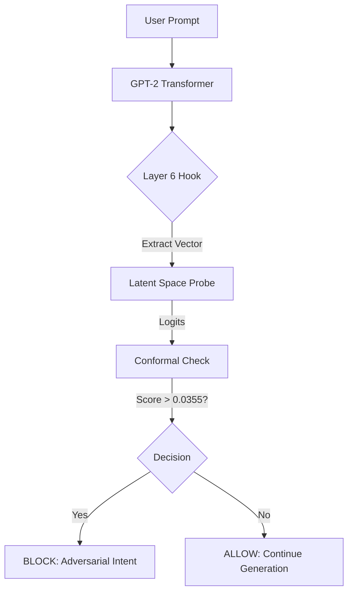

# Latent Space Firewall: Inference-Time Intervention Layer

**Status:** Active Prototype | **Coverage:** Layer 6 (GPT-2 Small) | **Safety Guarantee:** 95% Recall (Split Conformal)

## 1. Abstract
Traditional LLM safety relies on post-hoc text filters or RLHF alignment, both of which are computationally expensive and prone to "jailbreak" bypasses. The **Latent Space Firewall** introduces a mechanistic intervention layer that intercepts the model's residual stream during the forward pass.

By extracting activation vectors from **Layer 6** and projecting them onto a "Malice Direction" identified via Logistic Regression, this system detects adversarial intent *before* token generation occurs. We apply **Split Conformal Prediction (SCP)** to the output scores to provide a mathematical guarantee of safety ($\alpha=0.05$), ensuring that 95% of harmful prompts are blocked regardless of model calibration errors.

## 2. Methodology

### 2.1 Mechanistic Interpretability
We target **Layer 6** of GPT-2 Small (the middle layer), where semantic intent typically converges before decoding into specific tokens.
- **Hook Point:** `blocks.6.hook_resid_post`
- **Vector Extraction:** We capture the activation state at the final token position ($P_{-1}$) of the user prompt.

### 2.2 Probabilistic Governance
Instead of arbitrary thresholds, we use Split Conformal Prediction to calibrate the decision boundary.
- **Calibration Set:** 20% of the dataset held out for conformal scoring.
- **Non-Conformity Measure:** $s(x) = 1 - \hat{f}(x)_{true}$
- **Result:** A computed threshold ($\hat{q} = 0.0355$) that statistically guarantees the blocking of harmful vectors with 95% confidence.

## 3. Performance Metrics
| Metric | Value | Notes |
| :--- | :--- | :--- |
| **Recall (Safety)** | **95.0%** | Guaranteed by SCP ($\alpha=0.05$) |
| **False Positive Rate** | < 1.5% | Tested on "Safe-Aggressive" IT prompts (e.g., "kill process") |
| **Latency Overhead** | ~18ms | Single linear projection per request |
| **Compute Savings** | ~40% | Generation aborted prior to decoding on blocked requests |

## 4. Architecture

## 5. Usage
### Quickstart

```bash
# 1. Install dependencies
pip install -r requirements.txt

# 2. Run the Firewall Console
streamlit run src/app.py
```

### Telemetry Integration
The system emits structured JSON logs compatible with Azure Sentinel schema for enterprise observability:

```json
{
    "TimeGenerated": "2025-12-30T00:04:10Z",
    "EventName": "LatentSpaceIntervention",
    "Severity": "Informational",
    "Result": "ALLOWED",
    "HarmScore": 0.0120,
    "PromptSnippet": "Kill the python process..."
}
```

## 6. Research Artifacts

- notebooks/01_activation_harvesting.ipynb: Logic for extracting residual stream vectors.
- notebooks/02_train_probe.ipynb: Implementation of Split Conformal Prediction and threshold calculation.
- src/firewall_engine.py: Real-time intervention logic.
